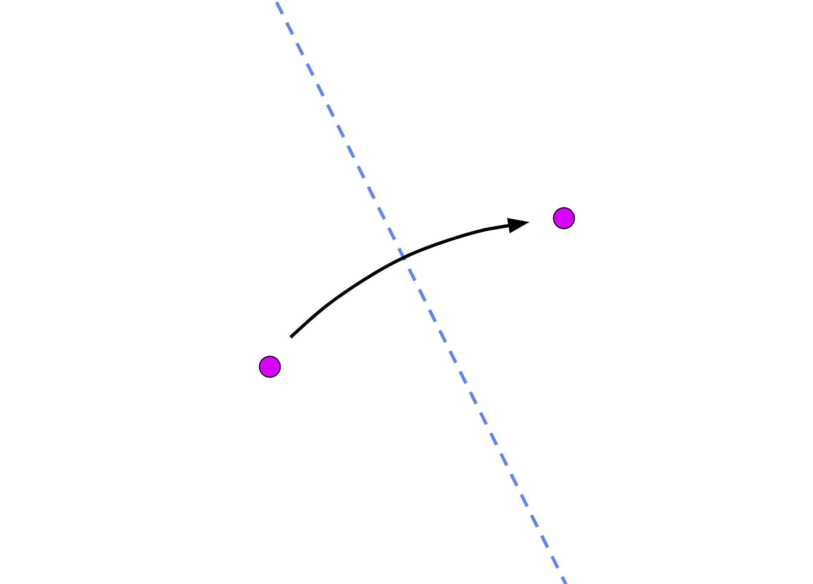
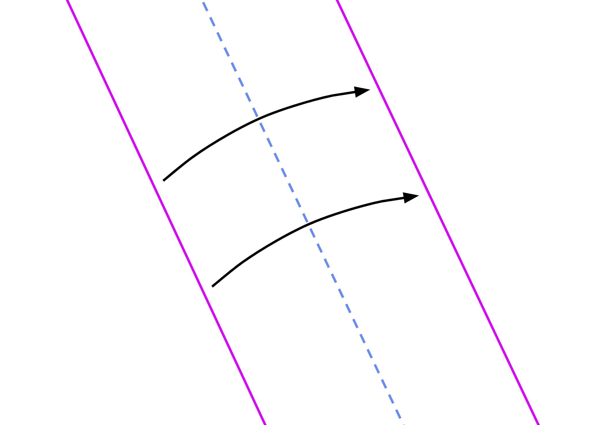
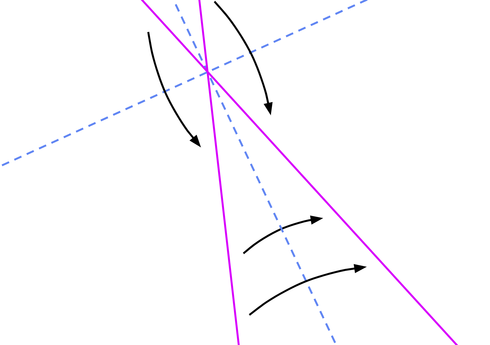
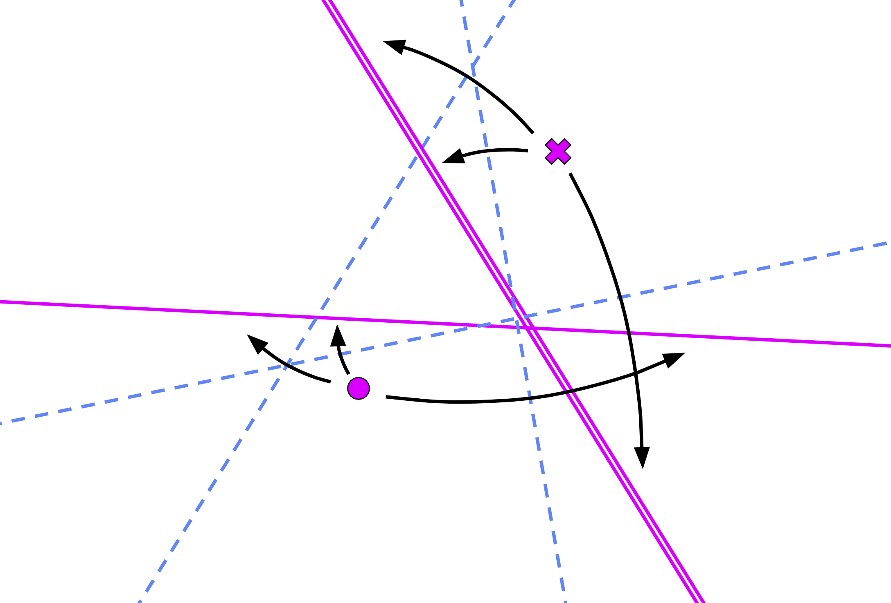
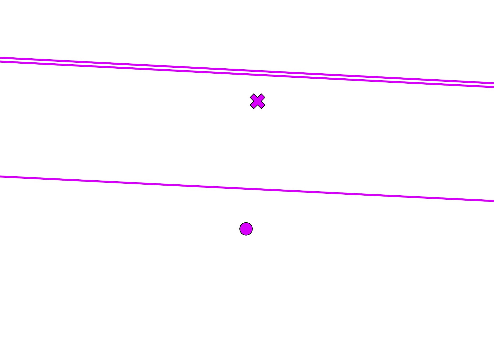
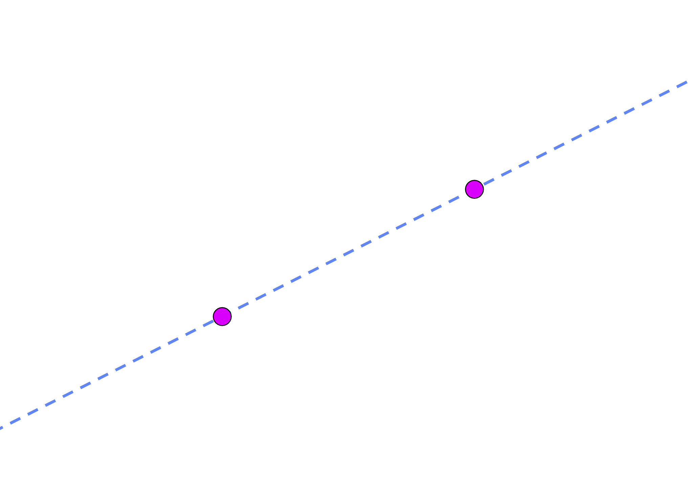
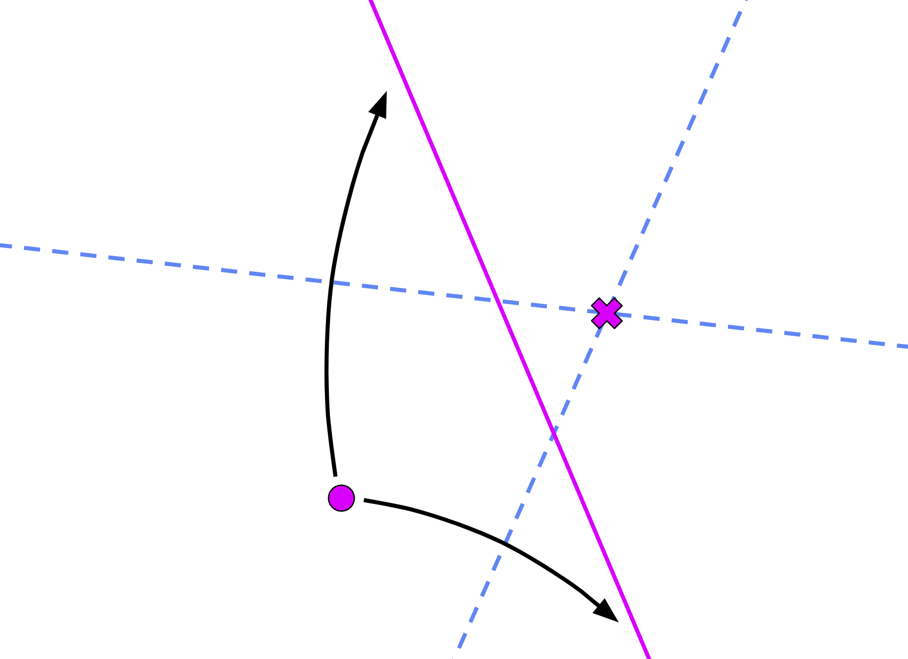
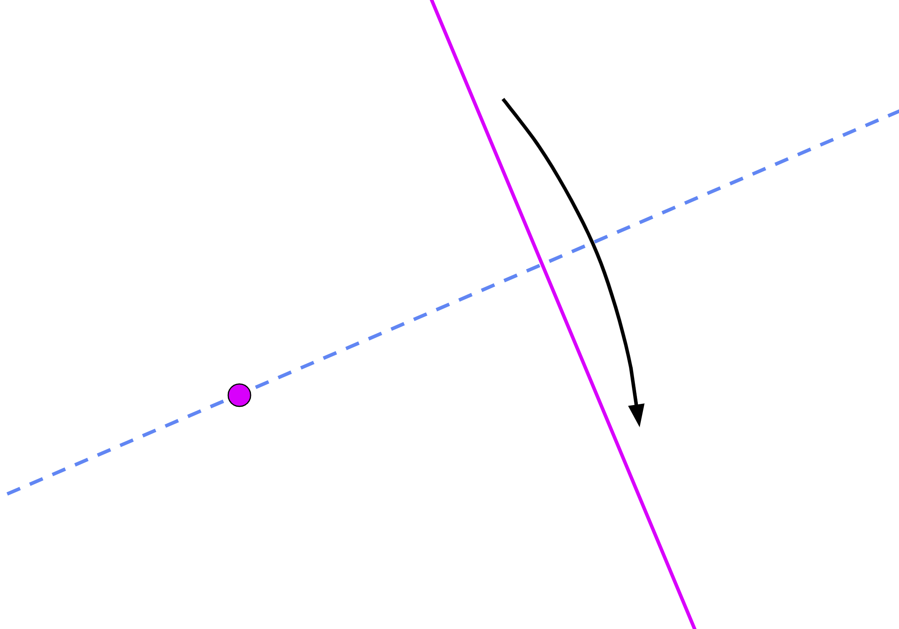
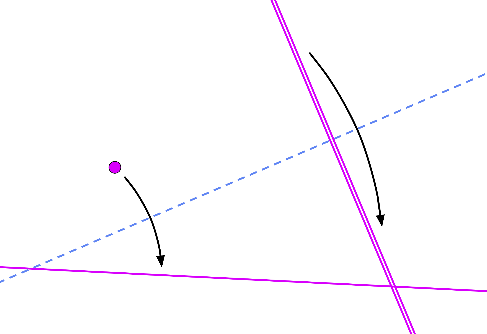
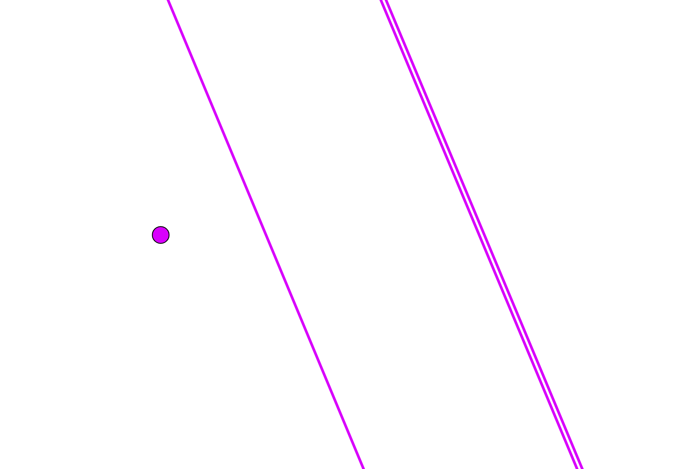

.. _folding:

Folding
=======

A "fold" is a reflection of points and/or lines across a crease. Origametry exports two functions for working with folds: :code:`fold` and :code:`reflect`.

The :code:`reflect` function simply returns the reflection of a point or line across a given crease:

.. code-block:: python

    from origametry import reflect

    # get the reflection of `point_1` when folded across the crease
    point_2 = reflect(point_1, crease)

    # you can also reflect lines
    line_2 = reflect(line_1, crease)

The :code:`fold` function is much more complex. It takes a pairwise series of points and/or lines and tries to find a fold that reflects every element onto its pair. The function returns the crease of that fold or a list of creases, or :code:`None` if no such fold is possible. This concept is best explained with pictures.

Fold `p1` onto `p2` (axiom 2):

.. code-block:: python

    from origametry import point, fold

    # create two points on the plane
    p1 = Point(0, 1)
    p2 = Point(3, 5)

    # find the fold that puts `p1` onto `p2`
    crease = fold(p1, p2)

Fold `line_1` onto `line_2` (axiom 3):

.. code-block:: python

    crease = fold(line_1, line_2)

If `line_1` and `line_2` are not parallel, there are 2 folds that work:

.. code-block:: python

    creases = fold(line_1, line_2)

    crease_1 = creases[0]
    crease_2 = creases[1]

Fold `p1` onto `line_1` **AND** `p2` onto `line_2` (axiom 6):

.. code-block:: python

    creases = fold(p1, line_1, p2, line_2)

    crease_1 = creases[0]
    crease_2 = creases[1]
    crease_3 = creases[2]

And here's an example of axiom 6 with no solutions:

.. code-block:: python

    creases = fold(p1, line_1, p2, line_2)

    assert creases is None

Some axioms require that a crease passes through a point. This is equivalent to reflecting that point onto itself.

Thus we can fold through `p1` and `p2` (axiom 1):

.. code-block:: python

    crease = fold(p1, p1, p2, p2)

And fold `p1` onto `line_1` through `p2` (axiom 5):

.. code-block:: python

    creases = fold(p1, line_1, p2, p2)

    crease_1 = creases[0]
    crease_2 = creases[1]

Finally, some axioms require that a crease is perpendicular to a line. This is nearly equivelent to reflecting a line onto itself, with the caveat that a crease going along a line also reflects it onto iself. Since the second case is trivial - the crease is identical to the original line - we choose to always interpret `fold(L, L, ...)` as being perpendicular to the line `L`.

Fold through `p1` perpendicular to `line_1` (axiom 4):

.. code-block:: python

    crease = fold(p1, p1, line_1, line_1)

Fold `p1` onto `line_1` perpendicular to `line_2` (axiom 7):

.. code-block:: python

    crease = fold(p1, line_1, line_2, line_2)

An example of axiom 7 with no solutions (`line_1` and `line_2` are parallel):

.. code-block:: python

    creases = fold(p1, line_1, line_2, line_2)

    assert creases is None
