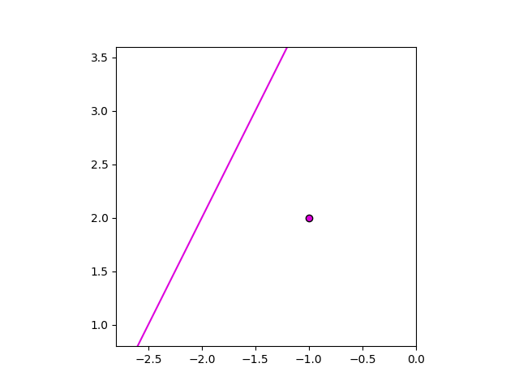
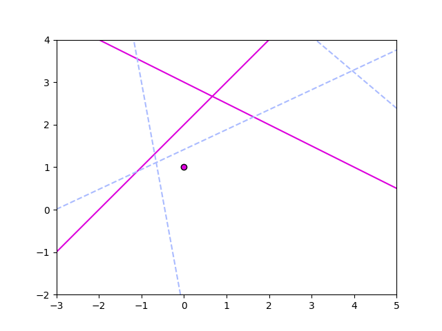

.. _showing:

Viewing Crease Patterns
=======================

Once you have created a series of folds you may wish to see what they look like in the plane. The :code:`show` function can do this for you.

Any :ref:`points <points>` and :ref:`lines <lines>` you pass to it are plotted and displayed using :code:`matplotlib`:

.. code-block:: python

    from origametry import Point, Line, show

    point = Point(-1, 2)
    line = Line(1, -.5, 3)

    show(point, line)

You can also pass lines as :code:`creases` to make them display as dashed lines in the plot. The :code:`creases` parameter accepts a list of :code:`Line` objects or a single :code:`Line` or :code:`None`, which means you can pass any result from the :code:`fold` function without worrying about its type:

.. code-block:: python

    from origametry import fold

    p1 = Point(0, 1)
    p2 = Point(3, 8)
    line_1 = Line(Point(0, 2), 1)
    line_2 = Line(Point(4, 1), -.5)

    # axiom 6: may have 0, 1, 2, or 3 solutions
    creases = fold(p1, line_1, p2, line_2)

    show(line_2, p1, line_1, p2, creases=creases)

.. image:: ../../images/plot_axiom_6.png
    :width: 360
    :alt: Screenshot of points, lines and creases plotted using the "show" function

The :code:`show` function always tries to calculate the best bounding box for each set of points, lines and creases. They will all be visible by default as well as any intersections of lines and/or creases. The bounding box is also square by default as a nod to traditional origami paper. You may override this by passing your own :code:`bounding_box` tuple of the form :code:`(min_x, min_y, max_x, max_y)`:

.. code-block:: python

    show(line_2, p1, line_1, p2, creases=creases, bounding_box=(-3, -2, 5, 4))

